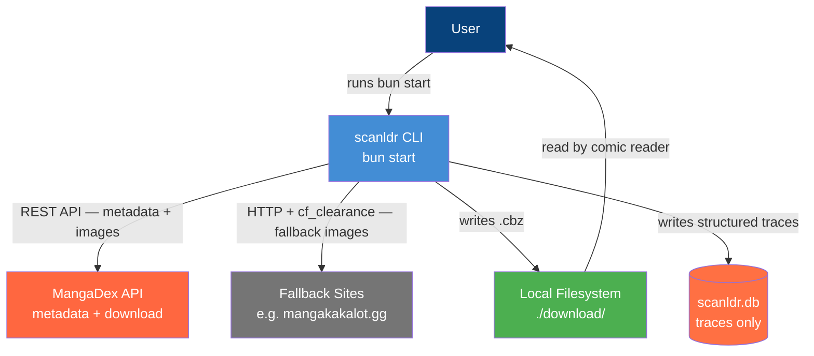
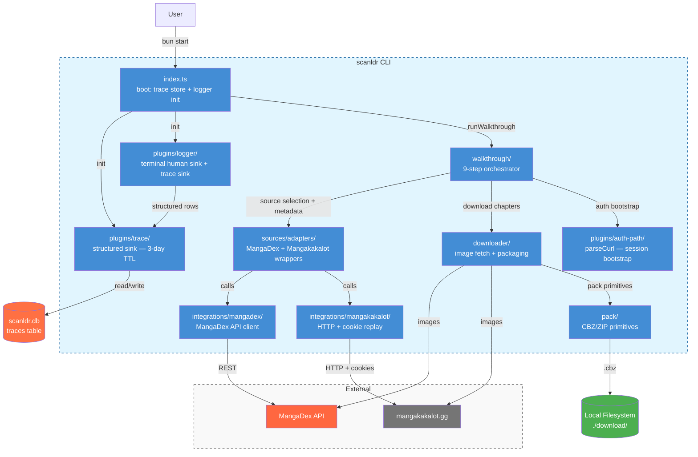

# Architecture C4: scanldr

> Last updated 2026-05-10 — reflects post-epic #116 state (walkthrough CLI, trace-as-state, no history/subscriptions).

## 1. Level 1: System Context

---

## 2. Level 2: Containers

---

## 3. Key Architectural Decisions

1. **Single one-shot walkthrough** — `bun start` runs a fixed 9-step orchestrator (`src/walkthrough/`). There are no sub-commands (`download`, `list`, `sync`, `update`, etc.) — those were removed in epic #116.
2. **MangaDex is the primary source** — metadata (volume→chapter mapping) and downloads come from MangaDex first. Fallback sites are only used when the user explicitly chooses them.
3. **User controls language and source** — the CLI never silently picks a language or falls back to another site. It always presents options and waits for confirmation.
4. **Auth uses manual cURL paste** — the user solves the Cloudflare challenge in a real browser, then copies the authenticated request via DevTools "Copy as cURL" and pastes it into the walkthrough prompt. No headless browser. See `docs/auth-manual.md` and `src/plugins/auth-path/`.
5. **Trace store is the only persistent state** — the `traces` table in `scanldr.db` is the single write path for the logger's structured sink. Retention is 3 days. No download history. No subscriptions. See ADR-006.
6. **One `.cbz` per volume** — chapters within a volume are merged into a single archive via `src/pack/`, matching how the user reads (complete volumes, not weekly chapters).
7. **Parser is site-specific** — each source has its own integration client under `src/integrations/`, surfaced through source adapters in `src/sources/`.
