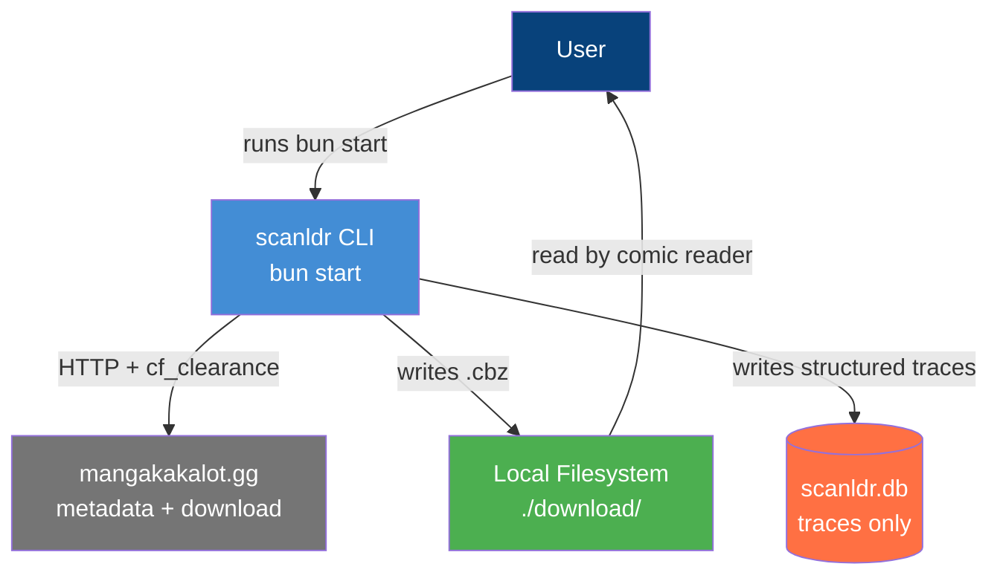
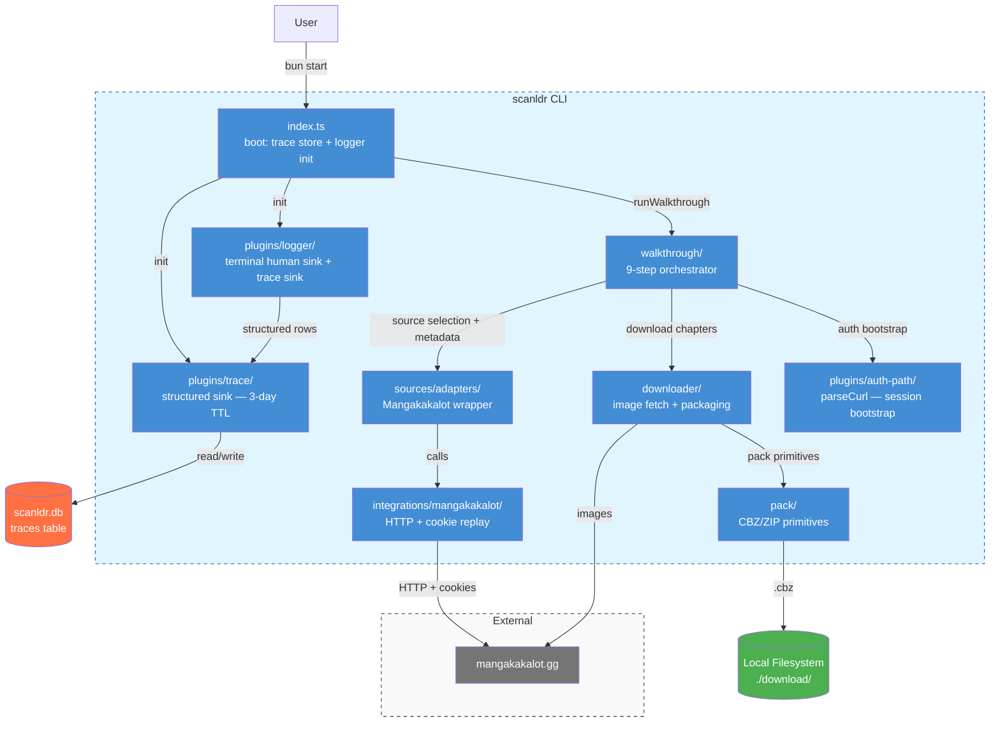

# Architecture C4: scanldr

> Last updated 2026-07-15 — reflects post-#177 state (mangakakalot sole source; MangaDex
> retired, see [ADR-008](adr/008-retire-mangadex-source.md)). Volume mode retirement is a
> separate, later phase (Phase B) and is not reflected here.

## 1. Level 1: System Context

---

## 2. Level 2: Containers

---

## 3. Key Architectural Decisions

1. **Single one-shot walkthrough** — `bun start` runs a fixed 9-step orchestrator (`src/walkthrough/`). There are no sub-commands (`download`, `list`, `sync`, `update`, etc.) — those were removed in epic #116.
2. **Mangakakalot is the sole source** — MangaDex was retired ([ADR-008](adr/008-retire-mangadex-source.md)); the source-picker step auto-selects Mangakakalot instead of prompting, since it's the only registered `SourceAdapter`.
3. **Auth uses manual cURL paste** — the user solves the Cloudflare challenge in a real browser, then copies the authenticated request via DevTools "Copy as cURL" and pastes it into the walkthrough prompt. No headless browser. Since Mangakakalot is now the sole source, every run requires this step. See `docs/auth-manual.md` and `src/plugins/auth-path/`.
4. **Trace store is the only persistent state** — the `traces` table in `scanldr.db` is the single write path for the logger's structured sink. Retention is 3 days. No download history. No subscriptions. See ADR-006.
5. **One `.cbz` per volume** — chapters within a volume are merged into a single archive via `src/pack/`, matching how the user reads (complete volumes, not weekly chapters). Volume mode retirement is tracked separately (Phase B) and is not part of ADR-008.
6. **Source adapter is a thin, replaceable seam** — `src/sources/adapters/` registers `SourceAdapter` implementations behind a factory; today only Mangakakalot is registered, but the seam supports adding sources later without touching the walkthrough orchestrator.
