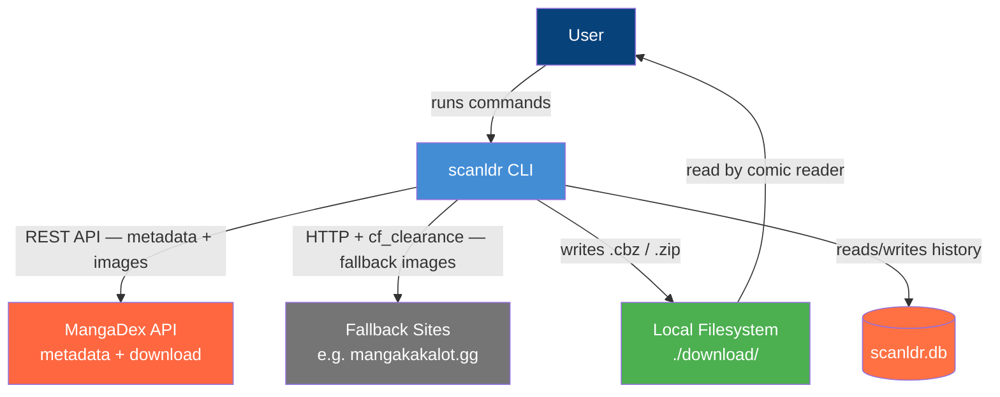

# Architecture C4: scanldr

## 1. Level 1: System Context



---

## 2. Level 2: Containers

```mermaid
graph TD
    User[User]

    subgraph scanldr [scanldr CLI]
        Index[index.ts<br/>Arg parsing / routing]
        MangaDexClient[sites/mangadex/client.ts<br/>MangaDex API client]
        MangaDexParser[sites/mangadex/parser.ts<br/>API response mapping]
        FallbackClient[sites/mangakakalot/client.ts<br/>HttpClient + cookie replay]
        FallbackParser[sites/mangakakalot/parser.ts<br/>HTML/JSON extraction]
        AuthService[sites/mangakakalot/auth/service.ts<br/>cURL paste auth — stdin]
        Downloader[downloader.ts<br/>Image download + packaging]
        History[history.ts<br/>SQLite download history]
        AuthFile[($XDG_DATA_HOME/scanldr/auth.json)<br/>Saved Cloudflare session]
    end

    subgraph External
        MangaDex[MangaDex API]
        FallbackSite[Fallback Site<br/>mangakakalot.gg]
    end

    DB[(scanldr.db<br/>SQLite)]
    FS[(Local Filesystem<br/>./download/)]

    User -->|CLI args| Index

    Index -->|search + metadata| MangaDexClient
    MangaDexClient -->|REST| MangaDex
    MangaDex -->|JSON| MangaDexParser
    MangaDexParser -->|VolumeInfo, ChapterRef[]| Index

    Index -->|user chose fallback| FallbackClient
    FallbackClient -->|reads| AuthFile
    FallbackClient -->|HTTP + cookies| FallbackSite
    FallbackSite -->|HTML| FallbackParser
    FallbackParser -->|ChapterRef[]| Index

    Index -->|auth command| AuthService
    AuthService -->|verifies session via parsed URL| FallbackSite
    AuthService -->|atomic write| AuthFile

    Index -->|download chapters| Downloader
    Downloader -->|images from MangaDex| MangaDex
    Downloader -->|images from fallback| FallbackSite
    Downloader -->|.cbz / .zip| FS

    Index -->|check / record| History
    History -->|read/write| DB

    style scanldr fill:#e1f5fe,stroke:#01579b,stroke-dasharray: 5 5
    style External fill:#f9f9f9,stroke:#333,stroke-dasharray: 5 5
    style Index fill:#438dd5,color:#fff
    style MangaDexClient fill:#438dd5,color:#fff
    style MangaDexParser fill:#438dd5,color:#fff
    style FallbackClient fill:#438dd5,color:#fff
    style FallbackParser fill:#438dd5,color:#fff
    style AuthService fill:#438dd5,color:#fff
    style Downloader fill:#438dd5,color:#fff
    style History fill:#438dd5,color:#fff
    style AuthFile fill:#ff7043,color:#fff
    style MangaDex fill:#ff6740,color:#fff
    style FallbackSite fill:#757575,color:#fff
    style DB fill:#ff7043,color:#fff
    style FS fill:#4caf50,color:#fff
```

---

## 3. Key Architectural Decisions

1. **MangaDex is the primary source** — metadata (volume→chapter mapping) and downloads come from MangaDex first. Fallback sites are only used when the user explicitly chooses them after being shown what MangaDex has available.
2. **User controls language and source** — the CLI never silently picks a language or falls back to another site. It always presents options and waits for confirmation.
3. **Auth uses manual cURL paste** — the user solves the Cloudflare challenge in a real browser, then copies the authenticated request via DevTools "Copy as cURL" and pastes it into `scanldr auth`. No headless browser or Playwright is involved. See `docs/auth-manual.md`.
4. **Download history is decoupled from output files** — SQLite records what was downloaded. The user can freely delete `.cbz` files without the CLI re-downloading them.
5. **One `.cbz` per volume** — chapters within a volume are merged into a single archive, matching how the user reads (complete volumes, not weekly chapters).
6. **Parser is site-specific** — each source has its own module under `src/sites/`, keeping the core downloader generic.
