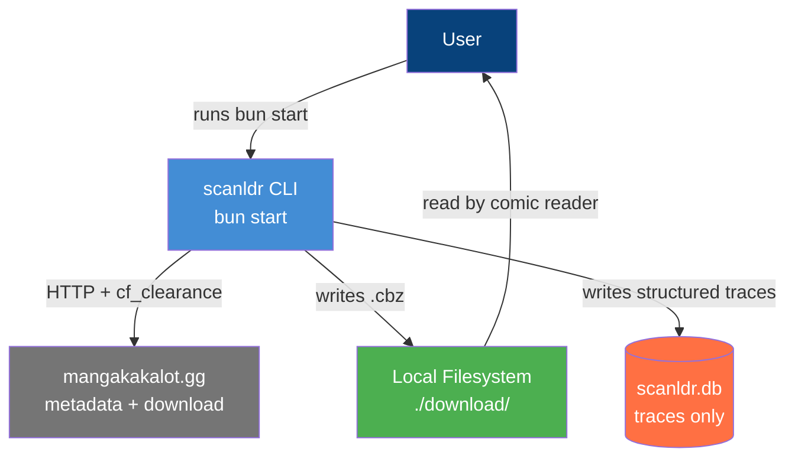
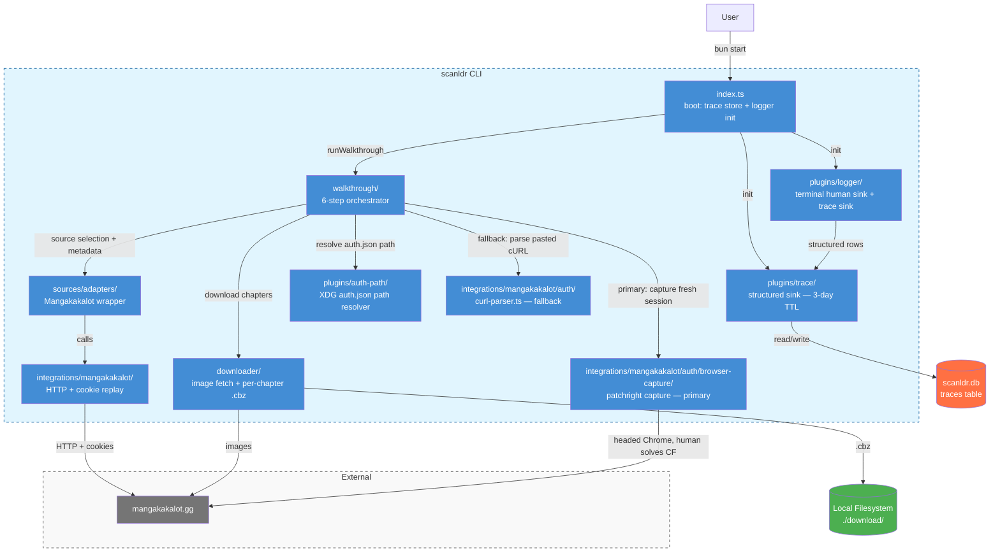

# Architecture C4: scanldr

> Last updated 2026-07-17 — reflects post-#210 state (v1.2.0): mangakakalot sole source;
> MangaDex retired, see [ADR-008](adr/008-retire-mangadex-source.md); chapter→volume grouping
> restored (optional), see [ADR-010](adr/010-restore-chapter-volume-grouping.md); auth is
> patchright undetected-browser capture (primary) with manual cURL paste (fallback), see
> [ADR-002](adr/002-manual-cookie-paste.md).

## 1. Level 1: System Context

---

## 2. Level 2: Containers

---

## 3. Key Architectural Decisions

1. **Single one-shot walkthrough** — `bun start` runs a fixed 6-step orchestrator (`src/walkthrough/`). There are no sub-commands (`download`, `list`, `sync`, `update`, etc.) — those were removed in epic #116.
2. **Mangakakalot is the sole source** — MangaDex was retired ([ADR-008](adr/008-retire-mangadex-source.md)); the source-picker step auto-selects Mangakakalot instead of prompting, since it's the only registered `SourceAdapter`.
3. **Auth uses patchright undetected-browser capture (primary), manual cURL paste (fallback)** — on a stale/absent session, the walkthrough launches the user's real Chrome via `patchright` (a Playwright fork with automation-detection leaks patched), the user solves the Cloudflare challenge in the visible window, and scanldr harvests the fresh `cf_clearance` + user-agent directly from the live browser context — no DevTools copying needed. On no-Chrome, cancel, capture error, or probe failure, it falls back to the manual cURL-paste flow. Since Mangakakalot is now the sole source, every run requires this step. See `docs/auth-manual.md`, `src/integrations/mangakakalot/auth/browser-capture/` (capture) + `curl-parser.ts` (fallback), and `src/plugins/auth-path/` (XDG path resolution only).
4. **Trace store is the only persistent state** — the `traces` table in `scanldr.db` is the single write path for the logger's structured sink. Retention is 3 days. No download history. No subscriptions. See ADR-006.
5. **One `.cbz` per chapter by default, with optional volume grouping** — chapter-only download mode was made the base ([ADR-009](adr/009-retire-volume-mode.md)), and chapter→volume grouping (pack + cover) was subsequently restored as an opt-in step ([ADR-010](adr/010-restore-chapter-volume-grouping.md)); every chapter is still downloaded individually, and grouping into a single volume `.cbz` is optional.
6. **Source adapter is a thin, replaceable seam** — `src/sources/adapters/` registers `SourceAdapter` implementations behind a factory; today only Mangakakalot is registered, but the seam supports adding sources later without touching the walkthrough orchestrator.
