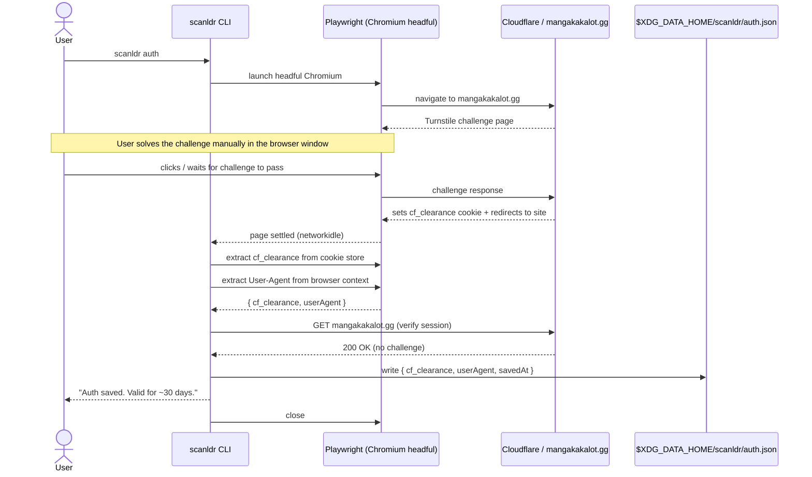

# Flow — Authentication (Cloudflare Bypass)

The auth flow is the only place where Playwright is used. It opens a real browser so the user can solve the Cloudflare Turnstile challenge. After the challenge passes, the CLI automatically extracts the `cf_clearance` cookie — no manual copy/paste.

The saved session is valid for approximately 30 days. When it expires, re-running `scanldr auth` is all that's needed.

## Sequence Diagram

## Error Cases

| Situation | Behavior |
|---|---|
| User closes the browser before challenge resolves | CLI exits with error — no auth saved |
| Site returns 403 after cookie replay | `CloudflareError` thrown — user must re-run `scanldr auth` |
| `$XDG_DATA_HOME/scanldr/auth.json` missing | Any download command exits early with "Not authenticated. Run `scanldr auth` first." |
| Cookie expired (>30 days) | Same as above — `CloudflareError` triggers re-auth prompt |
