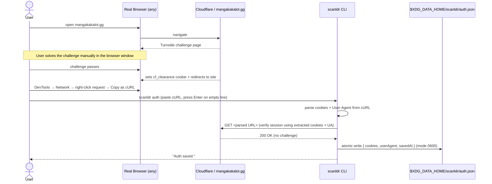

# Flow — Authentication (Cloudflare Bypass)

The auth flow uses a manual "Copy as cURL" paste from the browser's DevTools. No headless browser or Playwright is involved. The user solves the Cloudflare challenge themselves in a real browser, then copies the authenticated request and pastes it into the CLI.

The saved session is valid for approximately 30 days. When it expires, re-running `scanldr auth` is all that's needed.

See [`docs/auth-manual.md`](../auth-manual.md) for step-by-step instructions.

## Sequence Diagram

## Error Cases

| Situation | Behavior |
|---|---|
| User pastes empty input | CLI exits with error — no auth saved |
| `cf_clearance` missing from pasted cookies | `AuthError` thrown — user must re-copy from a solved-challenge request |
| User-Agent header absent from paste | `AuthError` thrown — re-copy with headers included |
| Site returns 403 after cookie replay | `AuthError` thrown — session may be stale, user must re-run `scanldr auth` |
| Cloudflare challenge body returned (200 but JS challenge page) | `AuthError` thrown — paste may be stale |
| `$XDG_DATA_HOME/scanldr/auth.json` missing | Any download command exits early with "Not authenticated. Run `scanldr auth` first." |
| Cookie expired (>30 days) | Same as above — re-auth prompt |
