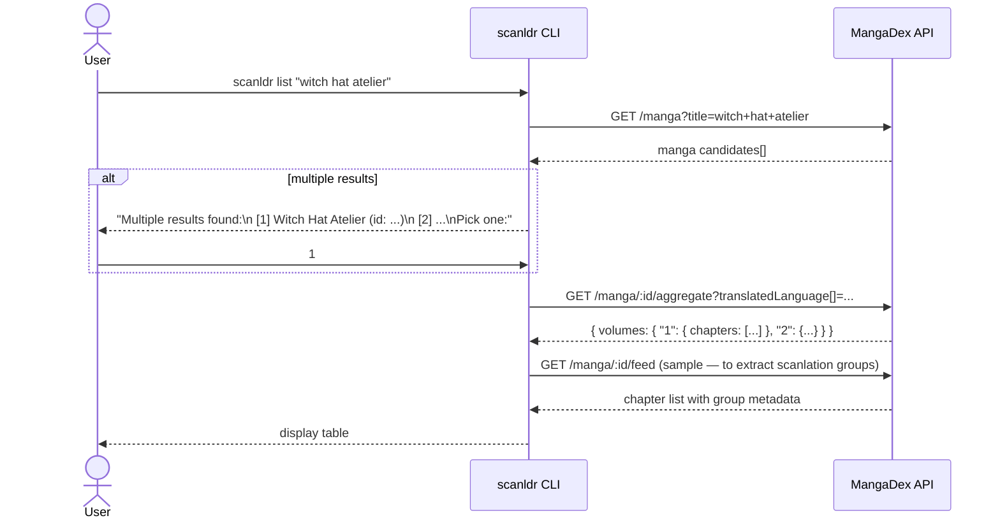

# Flow — List

> **Historical record (pre-epic #116).** Describes the standalone `list` command, which searched
> MangaDex and was removed in the #116 redesign; kept for history. See
> [ADR-008](../adr/008-retire-mangadex-source.md) / [ADR-009](../adr/009-retire-volume-mode.md)
> for current state.

The `list` command searches MangaDex for a title and displays all available volumes, languages, and scanlation groups. It is the primary discovery tool before running `download`.

No files are written and history is not touched.

## Sequence Diagram



## Output Example

```
Witch Hat Atelier
MangaDex ID: a96676e5-8ae2-425e-b549-7f15dd34a6d8

  Volume  Chapters  Languages & Groups
  ──────  ────────  ──────────────────────────────────────
  1       1–7       en (Atelier Scans), pt-BR (Família Scans)
  2       8–14      en (Atelier Scans), pt-BR (Família Scans)
  3       15–21     en (Atelier Scans)
  4       22–28     en (Atelier Scans)
  ...
  none    Special 1 en (Atelier Scans)
```

## Notes

- Volumes labeled `none` contain chapters not assigned to any volume on MangaDex.
- `list` always queries MangaDex regardless of configured fallback sites — it is a metadata command, not a download command.
