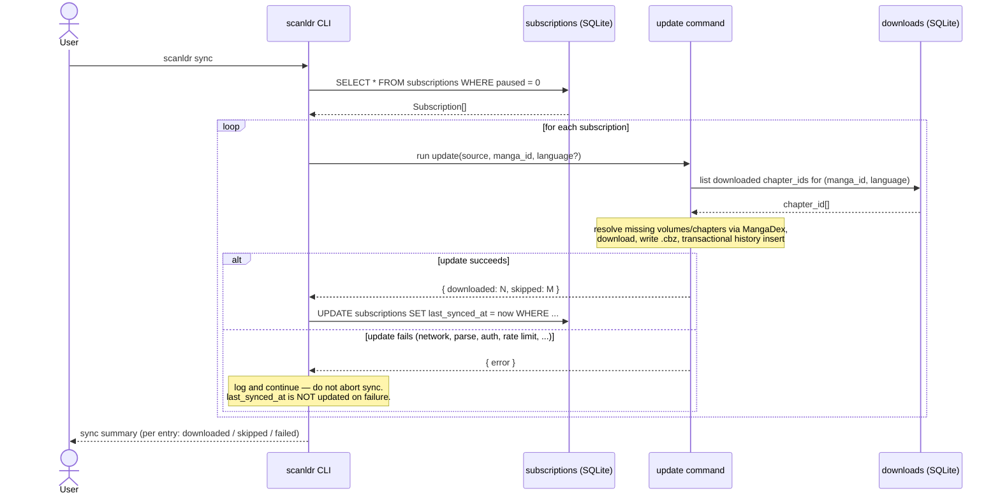

# Flow — Sync

> **Historical record (pre-epic #116).** Describes the standalone `sync` command and its
> `subscriptions` table, removed in the #116 redesign; kept for history. See
> [ADR-008](../adr/008-retire-mangadex-source.md) / [ADR-009](../adr/009-retire-volume-mode.md)
> for current state.

The `sync` command reads the active entries from the `subscriptions` table in `scanldr.db` and runs `update` on each one sequentially. It is designed to be run on a schedule (cron, launchd) to keep a local library up to date.

`sync` itself contains no download logic — it is pure orchestration on top of `update`. Anything that applies to `update` (history check, language resolution, fallback prompt, retries) applies transitively here.

The watchlist lives in SQLite (see `models/subscription_model.md`), not a flat file. Add/remove entries with `scanldr watch` / `scanldr unwatch`. For users coming from a `mangas.txt`-based workflow, `scanldr import <file>` does a one-shot conversion.

## Sequence Diagram

## Decisions

1. **Watchlist in SQLite, not flat file** — single source of truth, queryable, supports per-entry metadata (preferred language override, paused state, last sync timestamp). See `models/subscription_model.md`.
2. **Pure orchestration** — `sync` is a loop calling `update`. No duplicated logic, no filesystem checks. The `downloads` table (history) is the single source of truth for what was already downloaded, consistent with ADR-003.
3. **Sequential per manga** — sync processes one entry at a time to keep request patterns conservative and stay within MangaDex rate limits.
4. **Continues on error** — if one entry fails (network, parse, auth, rate limit), sync logs the failure and moves on rather than aborting. The end-of-run summary lists each entry's outcome.
5. **`last_synced_at` only on success** — a successful run updates the timestamp; a failure leaves the previous value, so users can see "this manga has been failing for N days" by querying `subscriptions`.
6. **Same output dir for all** — all manga land in the same `--out` directory (default `./download`).
7. **Non-interactive friendly** — `sync` is meant for cron. See `flows/update_flow.md` for how `update` resolves language without prompts when no preferred language matches (it skips the entry and logs, rather than blocking on stdin).
